# The schema, drawn

The 26 tables and how they relate. The authority is always
`src/app/core/database/migrations/001_initial_schema.sql`; this page is here to
be looked at. `tools/db/schema-diagram.test.mjs` checks it against the real
schema on every run, so it cannot quietly fall out of date.

GitHub renders the diagram below directly.

```mermaid
erDiagram
    currencies {
        TEXT code PK
        TEXT name
        TEXT symbol
        INTEGER minor_units
    }
    custom_icons {
        INTEGER id PK
        TEXT name
        TEXT mime_type
        BLOB data
    }
    account_groups {
        INTEGER id PK
        TEXT name UK
        TEXT builtin_icon
        INTEGER custom_icon_id FK
    }
    accounts {
        INTEGER id PK
        TEXT name UK
        TEXT type
        TEXT currency_code FK
        INTEGER group_id FK
        INTEGER custom_icon_id FK
        INTEGER credit_limit_minor
        INTEGER include_in_net_worth
        INTEGER opening_balance_minor
        INTEGER opening_balance_base_minor
        TEXT opened_on
        INTEGER archived
    }
    categories {
        INTEGER id PK
        TEXT name UK
        TEXT kind UK
        INTEGER parent_id FK
        INTEGER custom_icon_id FK
        INTEGER archived
    }
    transfers {
        INTEGER id PK
        TEXT occurred_on
        TEXT description
    }
    transactions {
        INTEGER id PK
        INTEGER account_id FK
        INTEGER category_id FK
        INTEGER pocket_id FK
        TEXT occurred_on
        INTEGER amount_minor
        INTEGER rate_scaled
        INTEGER amount_base_minor
        TEXT rate_source
        TEXT confidence
        INTEGER transfer_id FK
        TEXT transfer_leg
        TEXT import_fingerprint UK
        INTEGER import_seq UK
        INTEGER import_batch_id FK
        INTEGER locked
    }
    exchange_rates {
        TEXT on_date PK
        TEXT base_code PK, FK
        TEXT quote_code PK, FK
        INTEGER rate_scaled
        TEXT source
    }
    yield_accounts {
        INTEGER account_id PK, FK
        INTEGER opening_cushion_minor
        TEXT opening_on
        INTEGER withholding
        INTEGER enabled
    }
    yield_rates {
        INTEGER id PK
        INTEGER account_id FK
        INTEGER pocket_id FK
        TEXT valid_from
        INTEGER annual_rate_scaled
        INTEGER min_balance_minor
        INTEGER max_balance_minor
        INTEGER requires_monthly_spend_minor
        INTEGER fallback_annual_rate_scaled
        TEXT component UK
        TEXT payout
    }
    account_aliases {
        TEXT source_name PK
        INTEGER account_id FK
        TEXT note
    }
    yield_pockets {
        INTEGER id PK
        INTEGER account_id FK
        TEXT name UK
        TEXT source
        TEXT kind
        TEXT payout
        INTEGER payout_months
        TEXT opened_on
        INTEGER term_months
        INTEGER matures_into_pocket_id FK
        INTEGER income_category_id FK
        INTEGER withholding
        INTEGER include_in_net_worth
        INTEGER sort_order
    }
    yield_pocket_balances {
        INTEGER id PK
        INTEGER pocket_id FK
        TEXT valid_from
        INTEGER amount_minor
    }
    yield_days {
        INTEGER pocket_id PK, FK
        INTEGER account_id FK
        TEXT component PK
        TEXT payout
        TEXT on_date PK
        INTEGER balance_minor
        INTEGER annual_rate_scaled
        INTEGER gross_minor
        INTEGER withholding_minor
        INTEGER net_minor
        INTEGER actual_net_minor
        INTEGER withholding_unknown
        INTEGER locked
    }
    cashback_rules {
        INTEGER id PK
        INTEGER account_id FK
        TEXT name
        TEXT valid_from
        TEXT valid_to
        INTEGER percent_scaled
        INTEGER category_id FK
        INTEGER min_purchase_minor
        INTEGER max_cashback_minor
        INTEGER requires_account_id FK
        INTEGER requires_balance_minor
    }
    cashback_entries {
        INTEGER id PK
        INTEGER account_id FK
        INTEGER rule_id FK
        INTEGER source_transaction_id FK
        TEXT on_date
        INTEGER computed_minor
        INTEGER actual_minor
        INTEGER locked
    }
    product_kinds {
        INTEGER id PK
        TEXT name UK
        TEXT builtin_icon
        INTEGER custom_icon_id FK
        TEXT counts_as
        INTEGER archived
        INTEGER sort_order
    }
    cushion_adjustments {
        INTEGER id PK
        INTEGER account_id FK
        INTEGER pocket_id FK
        TEXT source
        TEXT kind
        INTEGER product_kind_id FK
        TEXT on_date
        INTEGER amount_minor
        INTEGER transaction_id FK
    }
    cushion_withdrawals {
        INTEGER id PK
        INTEGER account_id FK
        INTEGER pocket_id FK
        TEXT source
        TEXT on_date
        INTEGER amount_minor
        INTEGER transaction_id FK
    }
    tax_simulations {
        INTEGER year PK
        TEXT inputs
    }
    tax_parameters {
        INTEGER id PK
        TEXT key UK
        TEXT valid_from UK
        TEXT value
        TEXT source
        INTEGER confirmed
    }
    import_batches {
        INTEGER id PK
        TEXT file_name
        TEXT file_hash
        TEXT imported_at
        INTEGER rows_read
    }
    review_queue {
        INTEGER id PK
        TEXT kind
        TEXT entity_type
        INTEGER entity_id
        INTEGER batch_id FK
        TEXT reason
        INTEGER resolved
    }
    credit_limit_changes {
        INTEGER id PK
        INTEGER account_id FK
        INTEGER limit_minor
        TEXT effective_on
        TEXT source
    }
    deleted_imports {
        TEXT import_fingerprint PK
        INTEGER import_seq PK
        TEXT deleted_at
    }
    settings {
        TEXT key PK
        TEXT value
    }

    currencies     ||--o{ accounts          : "denominates"
    currencies     ||--o{ exchange_rates    : "base and quote of"
    account_groups ||--o{ accounts          : "one row per currency"
    custom_icons   ||--o{ accounts          : "illustrates"
    custom_icons   ||--o{ account_groups    : "illustrates"
    custom_icons   ||--o{ categories        : "illustrates"
    categories     ||--o{ categories        : "parent of"
    accounts       ||--o{ transactions      : "holds"
    categories     ||--o{ transactions      : "classifies"
    transfers      ||--o{ transactions      : "has exactly two legs"
    accounts       ||--o{ credit_limit_changes : "limit over time"
    accounts       ||--o| yield_accounts    : "earns a yield"
    accounts       ||--o{ yield_rates       : "at these rates"
    accounts       ||--o{ account_aliases    : "is also called"
    accounts       ||--o{ yield_pockets     : "split into"
    yield_pockets  ||--o{ yield_pocket_balances : "held this much"
    yield_pockets  ||--o{ yield_rates        : "earns at its own"
    yield_pockets  ||--o{ yield_days        : "day by day"
    accounts       ||--o{ yield_days        : "day by day"
    accounts       ||--o{ cashback_rules    : "rewards under"
    accounts       ||--o{ cashback_rules    : "conditioned on the balance of"
    categories     ||--o{ cashback_rules    : "restricted to"
    accounts       ||--o{ cashback_entries  : "receives"
    cashback_rules ||--o{ cashback_entries  : "worked out by"
    transactions   ||--o{ cashback_entries  : "produced"
    accounts       ||--o{ cushion_adjustments : "corrected by"
    yield_pockets  ||--o{ cushion_adjustments : "landed in"
    yield_pockets  ||--o{ transactions       : "money moved through"
    yield_pockets  ||--o{ cushion_withdrawals : "taken out of"
    yield_pockets  ||--o{ yield_pockets     : "a CDT matures into"
    categories     ||--o{ yield_pockets     : "a CDT's yield is recorded as"
    accounts       ||--o{ cushion_withdrawals : "moved into"
    transactions   ||--o| cushion_withdrawals : "became"
    transactions   ||--o{ cushion_adjustments : "cashed in by"
    product_kinds  ||--o{ cushion_adjustments : "is a"
    custom_icons   ||--o{ product_kinds       : "wears"
    import_batches ||--o{ transactions      : "brought in"
    import_batches ||--o{ review_queue      : "raised"
```

---

## Reading it in four layers

### 1. Catalog — the things you name

`currencies`, `custom_icons`, `account_groups`, `accounts`, `categories`.

An account holds exactly one currency. A real account that holds several —
Global66, ARQ — is several rows sharing an `account_groups` row, which is why
`group_id` points upward rather than accounts pointing at each other.

Icons hang off `custom_icons` from three places, because an account, a group
and a category can each use a picture the user supplied.

### 2. Ledger — the money itself

`transactions` and `transfers`. Everything else in the app is a view over
these two.

A transfer is a header with **exactly two** rows in `transactions` pointing at
it, one leg out and one leg in. There is no amount on `transfers` on purpose:
that keeps an account balance a single `SUM(amount_minor)` with no special
case, and lets the two legs be in different currencies.

### 3. Rates and the modules that need them

`exchange_rates` caches the official TRM.

The rest is the cushion: money earned but never counted on, kept deliberately
outside the balance of the account that produced it and outside net worth.

`yield_accounts` says which accounts the app accrues at all — an account with
no row here is never accrued, which is how the brokers stay out without a list
of names in code. `yield_rates` is the effective-annual-rate history you
maintain by hand, optionally banded by balance. `yield_days` is one row per
**pocket** per day, holding the balance and the rate it was worked out from, so
any figure can be explained rather than only recomputed.

`yield_pockets` is why the day belongs to a pocket rather than an account. One
account can be several pots that the bank pays separately — Dale is two
"alcancias" — and the withholding threshold applies to a payment, not to an
account. Adding the pots up before taxing charges withholding that is not owed:
on 2026-09-10 that was 386.73 pesos a day Dale was not actually charged. A
pocket either follows the account's own balance (`source = 'ledger'`, at most
one per account, holding whatever the others did not take) or carries a figure
typed in and dated in `yield_pocket_balances`, because a movement never says
which pocket it landed in.

`cashback_rules` holds the conditions as they stood on a date — a percentage,
optionally on one category, optionally requiring a minimum balance somewhere
else. `cashback_entries.source_transaction_id` is the link Monefy never had:
the reward knows which purchase produced it.

`cushion_adjustments` is money that landed in the cushion on a date, and
`kind` says what it was: `cashback` that arrived, a `correction` against what
the bank actually paid, or something `other` the note explains. They are kept
apart because their tax treatment is not the same — cashback is not withheld
and interest is.

An entry dated inside the range being worked out compounds into every day after
it, which is the half of this that matters: a daily yield is always worked out
on what was there the day before, so 10,000 arriving on a Wednesday has to make
Thursday onwards earn more. It did not, once, and the total came out right while
every day after the entry was quietly too small.

The correction case is still the common one: Most of these banks deposit once a month, so a daily
accrual is an estimate until the deposit lands; the difference is recorded here
rather than by rewriting the daily history, which is the evidence of what was
worked out and why. Signed, because the bank can pay more or less than expected.

`cushion_withdrawals` is money taken out of the cushion and into an account,
pointing at the movement it became so it is never counted twice.

`tax_parameters` holds the dated figures a withholding rule is made of, and
ships empty. Until a figure is entered and marked confirmed, the accrual runs
without withholding and says so.

### 4. Import bookkeeping

`import_batches`, `review_queue`, `settings`. Not finance — the paper trail of
how the data got in and what still needs a human.

---

## What happens when you delete something

The rule differs per relationship, and each choice is deliberate.

| Deleting | Effect | Why |
|---|---|---|
| an account with transactions | **refused** | history cannot be silently discarded; archive it instead |
| a category in use | **refused** | same |
| a custom icon in use | **refused** | no dangling picture references |
| a transfer | both legs go with it | half a transfer is money vanishing |
| an account group | its accounts survive, ungrouped | grouping is presentation, not money |
| a purchase that produced cashback | the cashback survives, unlinked | the money was real even if its cause is gone |
| an import batch | its review items go with it | they describe that run |
| an import batch (transactions) | transactions survive, unlinked | the money outlived the paperwork |
| an account | its rates and accruals go with it | they mean nothing without it |

---

## The constraints worth knowing

Beyond the foreign keys, these are enforced by `CHECK` and refuse bad data
outright:

- **Exactly one icon.** `accounts`, `categories` and `account_groups` each
  carry either `builtin_icon` or `custom_icon_id`, never both, never neither.
- **Only credit cards have a limit.**
- **A transfer leg has no category; a normal transaction must have one.**
- **A `from` leg cannot be positive, a `to` leg cannot be negative.**
- **`transfer_id` and `transfer_leg` are set together or not at all.**
- **Money is always an integer.** `typeof(amount_minor) = 'integer'` rejects
  floats and text outright.
- **Dates are ISO.** `2024-08-13` passes, `13/08/2024` does not.
- **A group holds each currency once.** Ungrouped accounts are exempt, so
  Bancolombia, Nequi and Plata can all be COP.
- **A resolved review item must say when it was resolved.**

## The indexes, and what each is for

| Index | For |
|---|---|
| `idx_transactions_import` | recognising rows on re-import; **partial**, so hand-made rows are unconstrained |
| `idx_transactions_account_date` | an account's statement, and balances as of a date |
| `idx_transactions_date` | the month view |
| `idx_transactions_category` | reports by category |
| `idx_transactions_pocket` | which product a movement went to; **partial**, since only a split account fills it |
| `idx_transactions_transfer` | fetching both legs of a transfer |
| `idx_accounts_name` | unique; the importer matches accounts by name |
| `idx_accounts_group_currency` | unique; one currency per group |
| `idx_categories_name_kind` | unique; the importer matches categories this way |
| `idx_yield_pockets_account` | the pockets of an account, in order |
| `idx_account_aliases_account` | the names a backup uses for one account |
| `idx_yield_pockets_default` | the product money lands in by default; **partial**, so an account has at most one |
| `idx_yield_pocket_balances` | what a pocket held on a date |
| `idx_yield_days_account` | every pocket's days for one account |
| `idx_yield_rates_account` | finding the rate in force on a date |
| `idx_yield_rates_pocket` | and the rates belonging to one pocket |
| `idx_yield_rates_shared`, `idx_yield_rates_own` | unique; one rate per component, band and date — counted apart for the account and for each pocket |
| `idx_cashback_rules_account` | the rules in force for a card on a date |
| `idx_cashback_entries_account`, `idx_cashback_entries_source` | the cashback ledger, and the reward a purchase produced |
| `idx_cushion_adjustments_account` | what has landed in an account's cushion |
| `idx_cushion_adjustments_pocket` | and which pocket it landed in |
| `idx_cushion_adjustments_kind` | and which kind it was filed under |
| `idx_product_kinds_name` | a kind is named once |
| `idx_cushion_adjustments_transaction` | the movement an entry is the other half of, when it is half of a cash-in |
| `idx_cushion_withdrawals_account` | what has been taken out of an account's cushion |
| `idx_tax_parameters_key` | the parameter in force on a date |
| `idx_review_queue_open` | listing what is still unresolved |
| `idx_credit_limit_changes_day` | unique; one credit limit per card per day |
