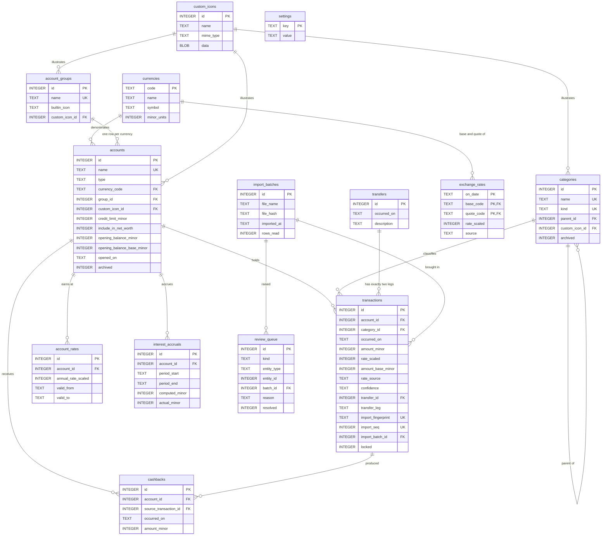

# The schema, drawn

The 14 tables and how they relate. The authority is always
`src/app/core/database/migrations/001_initial_schema.sql`; this page is here to
be looked at. `tools/db/schema-diagram.test.mjs` checks it against the real
schema on every run, so it cannot quietly fall out of date.

GitHub renders the diagram below directly.

---

## Reading it in four layers

### 1. Catalog — the things you name

`currencies`, `custom_icons`, `account_groups`, `accounts`, `categories`.

An account holds exactly one currency. A real account that holds several —
Global66, ARQ — is several rows sharing an `account_groups` row, which is why
`group_id` points upward rather than accounts pointing at each other.

Icons hang off `custom_icons` from three places, because an account, a group
and a category can each use a picture the user supplied.

### 2. Ledger — the money itself

`transactions` and `transfers`. Everything else in the app is a view over
these two.

A transfer is a header with **exactly two** rows in `transactions` pointing at
it, one leg out and one leg in. There is no amount on `transfers` on purpose:
that keeps an account balance a single `SUM(amount_minor)` with no special
case, and lets the two legs be in different currencies.

### 3. Rates and the modules that need them

`exchange_rates` caches the official TRM. `account_rates` is the per-account
interest history you maintain by hand. `interest_accruals` and `cashbacks`
hang off accounts, deliberately outside the balance of the account that
produced them.

`cashbacks.source_transaction_id` is the link Monefy never had: the cashback
knows which purchase produced it.

### 4. Import bookkeeping

`import_batches`, `review_queue`, `settings`. Not finance — the paper trail of
how the data got in and what still needs a human.

---

## What happens when you delete something

The rule differs per relationship, and each choice is deliberate.

| Deleting | Effect | Why |
|---|---|---|
| an account with transactions | **refused** | history cannot be silently discarded; archive it instead |
| a category in use | **refused** | same |
| a custom icon in use | **refused** | no dangling picture references |
| a transfer | both legs go with it | half a transfer is money vanishing |
| an account group | its accounts survive, ungrouped | grouping is presentation, not money |
| a purchase that produced cashback | the cashback survives, unlinked | the money was real even if its cause is gone |
| an import batch | its review items go with it | they describe that run |
| an import batch (transactions) | transactions survive, unlinked | the money outlived the paperwork |
| an account | its rates and accruals go with it | they mean nothing without it |

---

## The constraints worth knowing

Beyond the foreign keys, these are enforced by `CHECK` and refuse bad data
outright:

- **Exactly one icon.** `accounts`, `categories` and `account_groups` each
  carry either `builtin_icon` or `custom_icon_id`, never both, never neither.
- **Only credit cards have a limit.**
- **A transfer leg has no category; a normal transaction must have one.**
- **A `from` leg cannot be positive, a `to` leg cannot be negative.**
- **`transfer_id` and `transfer_leg` are set together or not at all.**
- **Money is always an integer.** `typeof(amount_minor) = 'integer'` rejects
  floats and text outright.
- **Dates are ISO.** `2024-08-13` passes, `13/08/2024` does not.
- **A group holds each currency once.** Ungrouped accounts are exempt, so
  Bancolombia, Nequi and Plata can all be COP.
- **A resolved review item must say when it was resolved.**

## The indexes, and what each is for

| Index | For |
|---|---|
| `idx_transactions_import` | recognising rows on re-import; **partial**, so hand-made rows are unconstrained |
| `idx_transactions_account_date` | an account's statement, and balances as of a date |
| `idx_transactions_date` | the month view |
| `idx_transactions_category` | reports by category |
| `idx_transactions_transfer` | fetching both legs of a transfer |
| `idx_accounts_name` | unique; the importer matches accounts by name |
| `idx_accounts_group_currency` | unique; one currency per group |
| `idx_categories_name_kind` | unique; the importer matches categories this way |
| `idx_account_rates_account` | finding the rate in force on a date |
| `idx_cashbacks_account`, `idx_cashbacks_source` | the cashback module |
| `idx_review_queue_open` | listing what is still unresolved |
